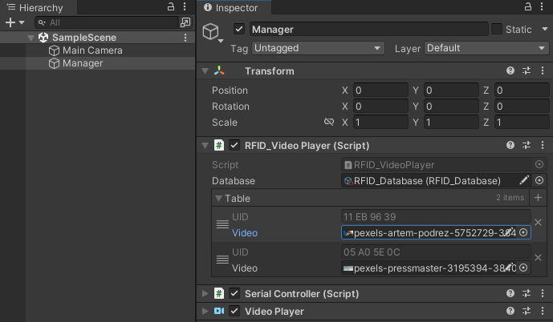

# Arduino RFID 範例專案

此專案進行了一個簡單的 Arduino 讀取 RFID 的 UID，透過 USB 傳輸至 Unity，並播放對應的 MP4 影片。

## 使用說明

1. 下載本專案並以 Unity 2021.3 系列的任一版本開啟。
2. 進入 SampleScene 場景，該場景檔案位於 Scenes 資料夾中。
3. 點擊 Manager 物件，修改 Serial Controller 中的 Port Name 為可讀取 Arduino 的接口名稱。 
4. 替換 Videos 資料夾中的檔案成你要使用的影片。 
5. 點擊 RFID_Database 後，點擊播放按鈕執行專案。將你所有的 RFID 標籤依序與 RFID 讀取器進行感應，RFID_Database 將自動儲存被感應的標籤 UID。完成感應後點擊停止按鈕執行專案 
6. 再次點擊 Manager 物件，展開 Table 列表，已儲存的 UID 將自動填入，這時即可將你的 MP4 影片拉入對應的 UID 欄位中。 
7. 最後再次點擊播放按鈕執行專案，並感應 RFID 標籤後，對應的影片將自動播放。